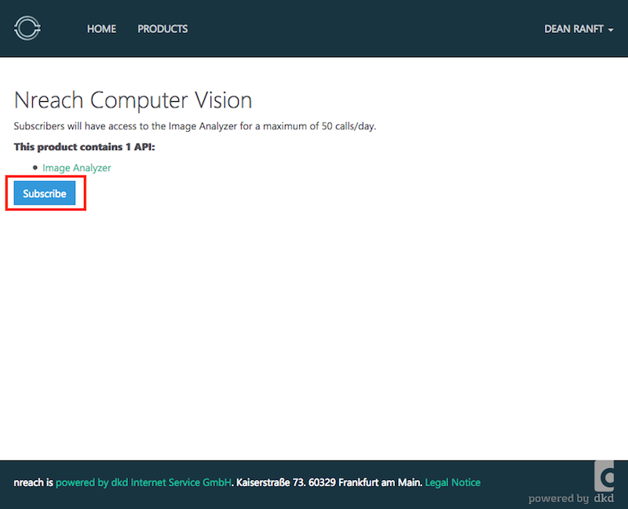
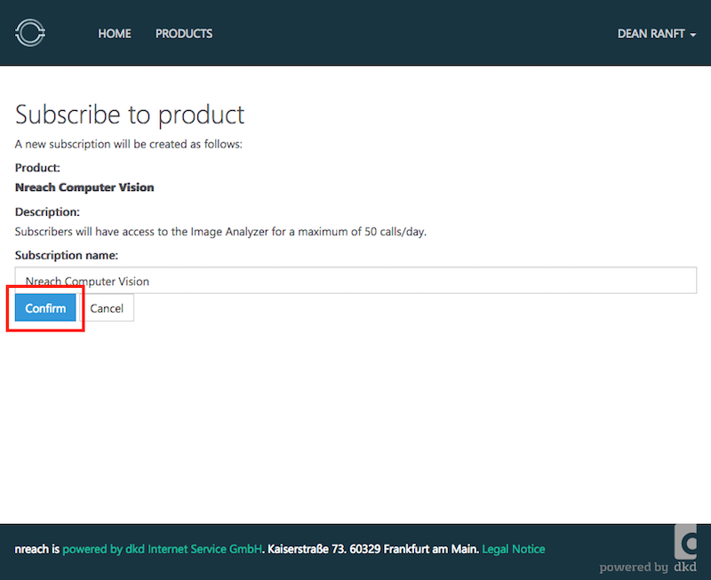
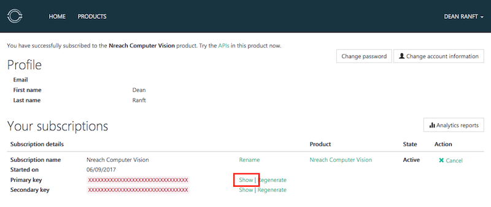
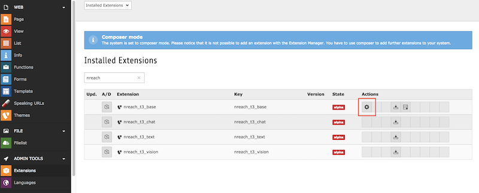
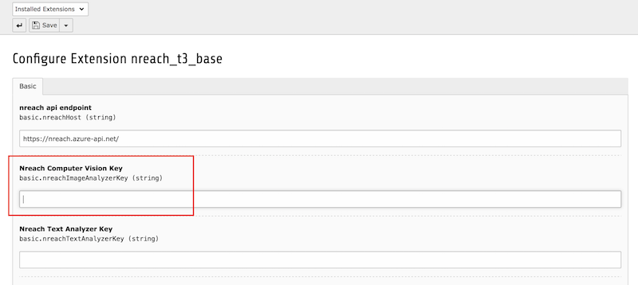
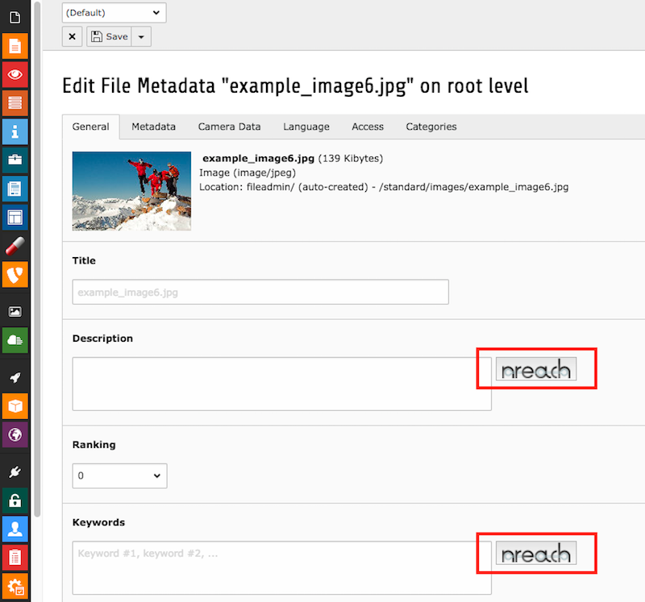
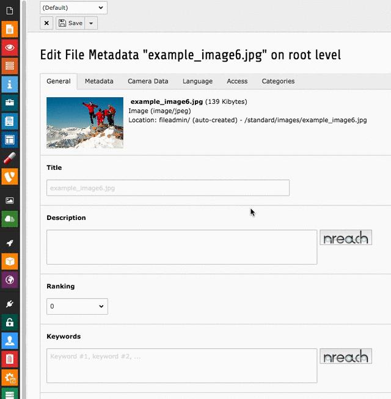

====================================
nreach.io
====================================

Installation
====================================

Product Signup
--------------

The first step for nreaching your content is to sign up at our portal and then install the extensions for your website. This guide will give you a step by step process you can tag along.

1. Go to our `sign up page <https://nreach.portal.azure-api.net/signup>`_.

2. Verify your email adress inside your mail programm.

3. Go to the `Computer Vision Product <https://nreach.portal.azure-api.net/products/58bc98f907b6540081060001>`_ and click subscribe.

4. Confirm your subscription.

5. Access your primary key by clicking show.

TYPO3 Configuration
-------------------

1. Install our extension and dependencies.

.. code:: bash

   composer require nreach/nreach-t3-vision

2. Goto your TYPO3 backend and open the extension configuration.

3. Insert your key from the product signup.

4. Goto some image inside the filelist and click the nreach buttons.

5. Profit

Scheduler Task Setup
--------------------

TBD

Technical Documentation
=======================

.. toctree::
   :maxdepth: 2

   nreach-base/README
   nreach-t3-base/README
   nreach-t3-vision/README
   nreach-t3-text/README
